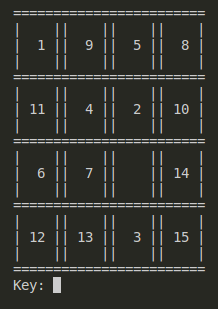

# Sliding puzzle game

Simple sliding puzzle game where you can move designated tile with number by means of keyboard keys:
- w - move up
- a - move left
- s - move down
- d - move right

To quit the game you can use "q" key.